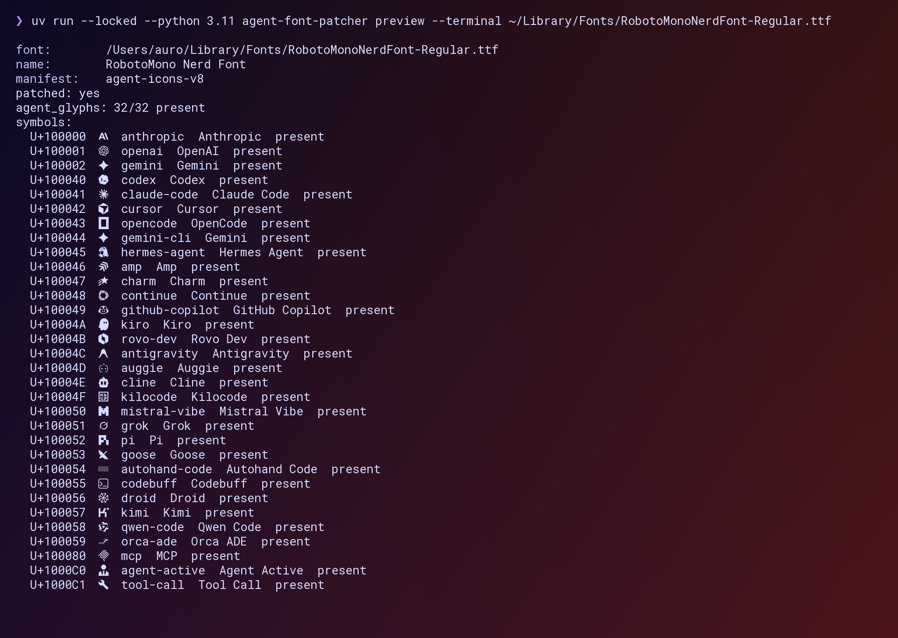

# Agent Font Patcher

Patch Nerd Fonts-compatible fonts with glyphs for modern agent tooling.

`agent-font-patcher` is a small CLI for users and terminal app maintainers who
need agent/provider/status glyphs in terminal surfaces where SVG rendering is
not available. GUI apps should still use SVG assets directly when they can.

## Status

- Packaged manifest: `agent-icons-v8`
- Packaged glyphs: 32 available, 0 reserved
- Codepoint range: `U+100000-U+1000FF` in Supplementary Private Use Area-B
- Implemented commands: `manifest`, `scan`, `patch`, `inspect`, `restore`,
  `preview`, and `cache refresh`

The current release candidate supports branch-off font generation, explicit
in-place patching with backups, cache refresh, patch metadata inspection, and
HTML or terminal specimen previews.

## Install For Development

```bash
uv sync --locked --dev
uv run agent-font-patcher --help
```

To install the local checkout as a tool:

```bash
uv tool install .
```

## Common Workflows

List the packaged manifest:

```bash
agent-font-patcher manifest
```

Scan likely installed Nerd Fonts:

```bash
agent-font-patcher scan
agent-font-patcher scan --font-dir ~/Library/Fonts
```

Create a branch-off font without modifying the source file:

```bash
agent-font-patcher patch "/path/to/JetBrainsMonoNerdFont-Regular.ttf" \
  --output-dir ./out
```

Patch a font in place, with a backup and font cache refresh:

```bash
agent-font-patcher patch --in-place "/path/to/JetBrainsMonoNerdFont-Regular.ttf"
```

Inspect a patched font:

```bash
agent-font-patcher inspect ./out/JetBrainsMonoNerdFont-Regular-Agent.ttf
```

Generate an HTML specimen:

```bash
agent-font-patcher preview ./out/JetBrainsMonoNerdFont-Regular-Agent.ttf \
  --output-dir ./out
```

Print the agent glyphs in the current terminal:

```bash
agent-font-patcher preview --terminal ./out/JetBrainsMonoNerdFont-Regular-Agent.ttf
```

Example terminal preview:



Restore an in-place backup:

```bash
agent-font-patcher restore "/path/to/JetBrainsMonoNerdFont-Regular.ttf"
```

## Release Checks

```bash
uv run --locked ruff check .
uv run --locked python -m pytest -q
uv build
```

## Documentation

- [Codepoint manifest](docs/codepoints.md)
- [Product decisions](docs/decisions.md)
- [Font cache behavior](docs/font-cache.md)
- [Asset sources](docs/asset-sources.md)
- [Agent SVG checklist](docs/agent-svg-checklist.md)
- [Release checklist](docs/release.md)

## Licensing And Trademarks

This repository's original code and documentation are MIT licensed. The
published package also contains third-party SVG-derived assets under their own
upstream license and attribution terms, including Apache-2.0 and CC-BY-4.0
assets. See [NOTICE.md](NOTICE.md) and
[docs/asset-sources.md](docs/asset-sources.md).

Bundling a logo or product mark in this font does not grant trademark, brand, or
other usage rights to downstream users. Projects using the font are responsible
for making sure their own use of any logo is allowed. Removal requests should be
opened as GitHub issues.
